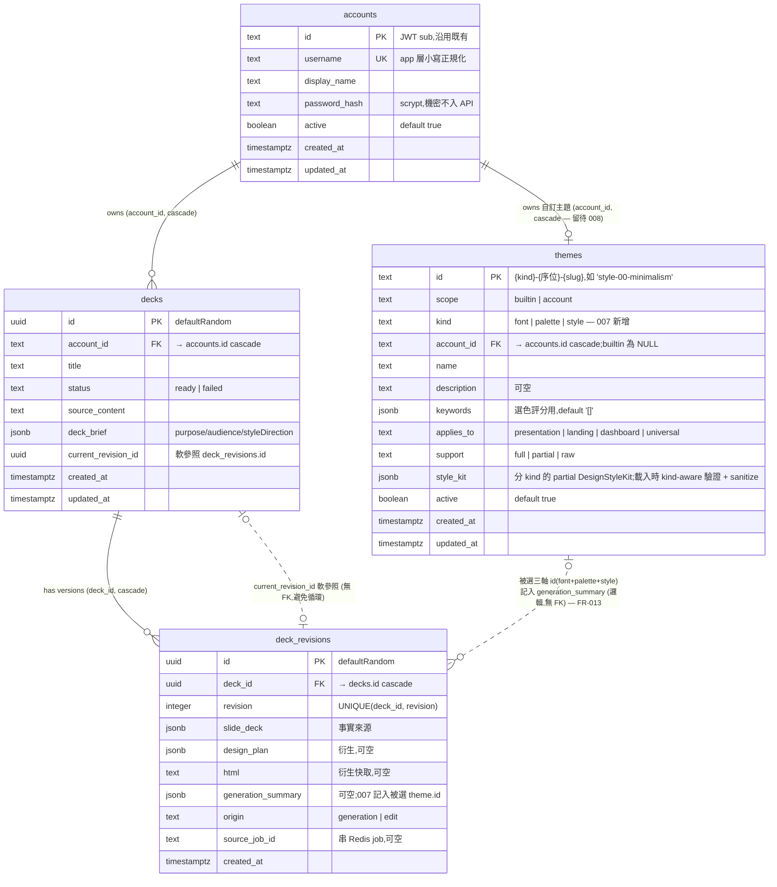

# Feature Specification: Design Theme System(builtin themes 入庫 + selection 必經 + 引擎 token 擴充)

<!-- This project writes Spec Kit artifacts in Traditional Chinese by default. -->

**Feature Branch**: `007-design-theme-system`

**Created**: 2026-06-05

**Status**: Draft

**Input**: User description: "Design theme system: seed builtin themes into the themes table from the ui-ux-pro-max CSVs (typography 56, colors 96, styles 67) — map the ~14 A-grade styles to full DesignStyleKit tokens, store B/C grades as partial/raw; make theme selection a mandatory engine step that reads from the DB (selectTheme) on both the LLM and fallback paths; add a CSV-to-seed conversion script; extend the rendering engine with the B-grade tokens (backdrop blur, glow, grain texture, animated gradient) so B-grade styles render full. User custom themes (scope=account) deferred to a later feature."

---

## 背景與目標

006 在 PostgreSQL 建立了 `themes` 表結構但**預留為空表**,交接文件 `THEME_SEED_INVENTORY.md` 盤點了設計知識庫(`.claude/skills/ui-ux-pro-max/data/*.csv`)與 app 真正執行的 design 層(`packages/domain/src/design/` + `rendering/`)之間的落差:

- 目前 codebase 的「theme」只有**顏色 + 字體**兩軸(各手抄 ~9 筆);真正讓風格長得不一樣的**結構維度(圓角/陰影/動態/底圖)全寫死在 `defaultDesignStyleKit`**。
- 真正「選具體字體+配色」的 `selectDesignStyleKit` **只掛在 LLM 成功路徑**(透過 `withCuratedStyleKit`);純 fallback 只拿 `defaultDesignStyleKit`,不套 curated 風格。

007 把「設計風格」從寫死常數升級為**資料驅動的 builtin theme 目錄**,並讓「選 theme」成為**獨立必經步驟**:

1. 把三個 CSV(typography 56 / colors 96 / styles 67)轉成 seed 並灌進 `themes` 表;A 級 ~14 個風格手動映射成完整 `DesignStyleKit` token,B 級擴充引擎 token 後升為 full,C 級以 `raw` 原文存放、引擎暫不渲染。
2. selection 改為必經步驟——`ThemeStore` adapter 從 DB 撈候選、純函式 `selectTheme` 做 deterministic 選擇,**LLM 成功與 fallback 兩條路徑都套到一個具名 builtin theme**,不再有「fallback 只拿 default」的缺口。
3. 渲染引擎擴充 B 級所需 token(backdrop blur / glow / grain 紋理 / 漸層動畫),讓 B 級風格能 full 渲染。

設計原則(沿用 006):**宣告式狀態放 DB,確定性引擎留 codebase**。DB 只放 token(燃料);`buildDeckStyleCss` / `renderTemplateDeck`(引擎)永不進 DB,且對每個內插值逐值 sanitize。domain 維持純淨(不含 SQL),DB 存取走 port/adapter。

---

## Clarifications

### Session 2026-06-05

- Q: 007 核心範圍? → **A:** A 級 themes 灌 seed + selection 改必經步驟(`ThemeStore` adapter 讀 DB、`selectTheme` 純函式選)+ CSV→seed 轉換腳本(全量入庫、B/C 打 partial/raw 標籤)。**使用者自訂主題(scope=account)留待後續 feature。**
- Q: B 級風格需要的引擎 token(blur/glow/grain/gradient 動畫)要在 007 做嗎? → **A: 全部 B 級 token 都做**,B 級隨之從 partial 升為 full。

### Session 2026-06-06

- Q: 三個 CSV(styles 67 / typography 56 / colors 96)如何落到 themes 表? → **A: 模型 C —— 全部進 themes 表,新增 `kind` 欄(`font` | `palette` | `style`)區分。** `selectTheme` 對三類各自關鍵字評分挑一,再 `composeKit` 合併成完整 `DesignStyleKit`(即把既有 `selectDesignStyleKit` 的 font×palette×structure 一般化,三軸候選全改由 `ThemeStore` 從 DB 撈、`selectTheme` 純函式選)。連帶後果:(1)`themes` 表新增 `kind` 欄(小 migration);(2)`style_kit` 為**分 kind 的 partial kit**,驗證需 kind-aware;(3)「被選 theme」為三元組(font+palette+style),證據以類 `kitName`(`style+palette+font`)記錄。
- Q: selectTheme 設為必經後,跟既有 LLM design planner 如何分工? → **A: 模型 A —— selectTheme 只負責 `styleKit`(三軸組合,確定性,兩路徑都跑);LLM design planner 仍照常產 `designSystem` / `slidePatternAssignments` / `chartTreatmentPlans`(內容感知層)。** LLM 失敗時用 fallback 的 designSystem + selectTheme 的 styleKit——fallback 也終於有 curated styleKit。LLM 不參與 theme 選擇(theme 為確定性 domain 邏輯,合 CR-004)。
- Q: seed 資料來源與可重現性,db:seed 執行時讀什麼? → **A: 轉換腳本(dev-time)把 3 CSV 轉成 committed JSON seeds(`apps/api/src/infra/db/seeds/*.json`);font/palette 自動轉、`style` kind 的 token 人工補進 JSON。** `db:seed` runtime 只讀 repo 內 JSON,**app/CI 不依賴 `.claude/skills`**。JSON 進版控、diff 可審查、可重現。
- Q: brief 無命中關鍵字 / 多筆平手時各軸怎麼收斂? → **A: 沿用現有 `pickBest` —— 無命中或平手取候選清單第一筆(index 0 勝)。** 為維持確定性,`ThemeStore.listSelectable` MUST 回傳**穩定排序**(`ORDER BY id`),使「第一筆」可重現;安全預設透過 seed id `00` 序位前綴(如 `style-00-minimalism`)保證排在各 kind 首位。
- Q: 既有 `selectDesignStyleKit` + `CURATED_FONT_PAIRINGS`/`CURATED_PALETTES`(各 9)+ `withCuratedStyleKit` 怎麼處置? → **A: 資料移除、引擎留下,DB 為單一來源。** 移除 9 筆寫死常數(確保其精調已併入 56/96 seed);compose 引擎函式(`buildPaletteHues` / `buildCuratedEffects` / `buildBackground` / `pickBest`)**保留**供 `composeKit` 用。`selectDesignStyleKit` 重構為 `selectTheme`(純函式,接收 `ThemeStore` 撈出的候選)+ `composeKit`;最終 fallback 仍為 `defaultDesignStyleKit`(單層,不保留 code 常數中間層)。

---

## User Scenarios & Testing *(mandatory)*

### User Story 1 - 每份簡報都套到具名 builtin theme,fallback 不再裸奔 (Priority: P1)

登入後的使用者貼上內容生成簡報。無論設計階段走 LLM 成功路徑或 fallback 路徑,系統都**先選定一個具名的 builtin theme**(依 brief 的關鍵字評分),再以該 theme 的 token 渲染。產出的簡報帶有真正的風格(配色/字體/圓角/陰影/動態),而非寫死的 default;`generationSummary` / 內部證據可看出選了哪個 theme。

**Why this priority**: 這是本 feature 對使用者最直接的價值,也修掉現況最大的缺口(fallback 路徑無風格)。只實作這一條就能讓「每份簡報都有像樣的設計」成為必然,構成可交付的 MVP。

**Independent Test**: 灌入一小批 A 級 builtin themes 後,分別觸發 LLM 成功與 fallback 兩條路徑,驗證兩者都套到 DB 來的具名 theme 且 HTML 帶對應 token;DB 無 theme 時安全退回 `defaultDesignStyleKit` 不報錯。

**Independent Demo**: 不依賴 US2 全量 seed/US3 B 級 token——只要有幾筆 A 級 theme,即可示範「同一份內容、不同 brief 關鍵字 → 選到不同 theme → 渲染外觀不同」,且關掉 LLM(走 fallback)依然有風格。

**Acceptance Scenarios**:

1. **Given** DB 已有 A 級 builtin themes 且 LLM port 可用, **When** 使用者生成簡報, **Then** 系統依 brief 選定一個 `applies_to=presentation` 且 `support in (full, partial)` 的 theme,HTML 以該 theme token 渲染,內部證據記錄被選 theme 的 id。
2. **Given** DB 已有 A 級 builtin themes 但 LLM port 不可用或產出無效, **When** 使用者生成簡報(走 fallback), **Then** 系統仍選定具名 builtin theme 並套用,**不**退回無風格 default。
3. **Given** DB 完全沒有可選 theme(seed 未跑), **When** 使用者生成簡報, **Then** 系統安全退回 `defaultDesignStyleKit`,流程不中斷、不報錯,並在證據中標明「無可選 theme,使用 default」。
4. **Given** brief 沒有明顯關鍵字, **When** `selectTheme` 評分, **Then** 回傳一個安全預設 theme(如 Minimalism),選擇對同一輸入為確定性(deterministic)。

---

### User Story 2 - CSV→seed 轉換腳本與全量 builtin theme 目錄 (Priority: P2)

維運者執行 `pnpm db:seed`(migration 後)把三個來源 CSV 轉成的 seed upsert 進 `themes` 表:typography 56、colors 96、styles 67 全部入庫。styles 依盤點分級打標籤——A 級 `support=full`(含完整 token)、B 級 `support=full`(007 擴 token 後)、C 級 `support=raw`(只存 Design System Variables 原文)、非簡報主題照標 `applies_to`(landing/dashboard/universal)。seed 為可重跑的 idempotent upsert。

**Why this priority**: 提供完整、可追溯、可重跑的 theme 目錄,讓 selection 有足夠候選且未來升級(C→full)不必重 seed。次於 US1,因為 US1 只需少量 A 級 theme 即可成立。

**Independent Test**: 在乾淨 DB 跑 seed,驗證 `themes` 列數與標籤分佈符合盤點;重跑 seed 不產生重複列、不破壞既有列;每筆 `style_kit` jsonb 通過載入時驗證。

**Independent Demo**: 跑一次 seed 後以 SQL 列出各 `applies_to` / `support` 的 theme 數量,展示「全部 CSV 已成為資料、gate 在 selection 層」。

**Acceptance Scenarios**:

1. **Given** 乾淨已 migrate 的 DB, **When** 執行 seed, **Then** `themes` 含全部 builtin 列,A 級為 `support=full`、C 級為 `support=raw`、非簡報主題的 `applies_to` 正確標記。
2. **Given** 已 seed 過的 DB, **When** 再次執行 seed, **Then** 結果 idempotent(無重複列、`updated_at` 可更新但不新增重複 id)。
3. **Given** 某筆 seed 的 `style_kit` 含不合引擎 token schema 的值, **When** 載入該 seed, **Then** 全量驗證在寫入前攔截,**整批 rollback**、回報所有不合法列,DB 維持原狀(不留半殘 catalog)。

---

### User Story 3 - B 級引擎 token 擴充,B 級風格升 full (Priority: P3)

設計師/維運者希望 Glassmorphism、Aurora UI、Y2K、Gradient Mesh、Vintage Analog 等 B 級風格能完整渲染。007 在渲染引擎擴充四類 token——backdrop blur、glow、grain 紋理疊層、漸層動畫——並把對應 B 級 theme 的 `support` 從 partial 升為 full。所有新 token 沿用既有逐值 sanitize。

**Why this priority**: 提升風格豐富度,但非 MVP 必需(B 級即使停在 partial,US1/US2 仍可交付)。每個新 token 是一次引擎小改 + CSS 對應。

**Independent Test**: 對使用新 token 的 B 級 theme 渲染,驗證輸出 CSS 帶 backdrop-filter blur / glow box-shadow / grain overlay / 漸層動畫 keyframe,且非法值被 sanitize 擋下;未用到新 token 的既有 A 級 theme 渲染不變(回歸)。

**Independent Demo**: 並排展示同一份內容套 Glassmorphism(blur)與 Aurora(漸層動畫)的渲染差異。

**Acceptance Scenarios**:

1. **Given** 一筆使用 backdrop blur token 的 B 級 theme, **When** 渲染, **Then** 輸出 CSS 含經 sanitize 的 `backdrop-filter: blur(...)`,卡片呈現玻璃感。
2. **Given** 一筆使用漸層動畫 token 的 B 級 theme, **When** 渲染, **Then** 輸出含對應 keyframe 與 `prefers-reduced-motion` 降級,動畫遵守既有 motion 規範。
3. **Given** B 級新 token 帶非法 CSS 值, **When** 渲染, **Then** 既有 `HEX_PATTERN` / `UNSAFE_CSS_VALUE` sanitize 攔截,不洩漏進 HTML。
4. **Given** B 級 token 擴充完成, **When** seed 載入 B 級 theme, **Then** 其 `support` 標記為 `full`。

---

### Edge Cases

- **DB 無可選 theme**(seed 未跑或全 inactive):`selectTheme` 安全退回 `defaultDesignStyleKit`,流程不中斷。
- **brief 無明顯關鍵字**:各軸取穩定排序下的第一筆候選(確定性);安全預設(如 Minimalism)以 seed id `00` 序位前綴保證排首位。
- **DB 來的 `style_kit` 含非法 CSS/HEX**:既有逐值 sanitize 擋掉,不渲染進 HTML。
- **theme 的 `applies_to != presentation`**(landing/dashboard/universal):預設 selection 不挑(universal 視為可選)。
- **B 級 token 缺值**(partial 殘留或 raw):引擎忽略缺的 token,不破版。
- **seed 重跑**:idempotent upsert,不重複 id、不產生半殘列。
- **C 級 raw theme 被選中**:預設 selection 排除 `support=raw`,確保不會選到無法渲染的 theme。

## Requirements *(mandatory)*

### Functional Requirements

- **FR-001**: 系統 MUST 提供 `selectTheme` 作為設計階段的**必經步驟**,在 LLM 成功與 fallback 兩條路徑都先選定 theme 再渲染。`selectTheme` 對 `font` / `palette` / `style` 三個 `kind` 各挑一,再 `composeKit` 合併成完整 `DesignStyleKit`(既有 `selectDesignStyleKit` 的 font×palette×structure 一般化版;三軸候選改由 `ThemeStore` adapter 自 DB 撈出後傳入,`selectTheme` 本身為純函式不查 DB)。`selectTheme` MUST 只負責 `styleKit`;`designSystem` / `slidePatternAssignments` / `chartTreatmentPlans` 仍由 LLM design planner(成功時)或 fallback(失敗時)提供。
- **FR-002**: `selectTheme` MUST 依 brief(purpose/audience/styleDirection)對各 `kind` 候選的 `keywords` 評分挑最佳(沿用既有 `pickBest`);無命中或平手取候選清單**第一筆**。`ThemeStore.listSelectable` MUST 回傳穩定排序(`ORDER BY id`),使選擇為**確定性**(同輸入同輸出)且可重現。為保證「第一筆」即各軸的**安全預設**,seed id MUST 採可排序前綴約定——安全預設用 `00` 序位(`style-00-minimalism` / `palette-00-safe-default` / `font-00-sans-default`),其餘用 `10`+ 序位,使 `ORDER BY id` 下安全預設恆排首位。
- **FR-003**: 候選集 MUST 預設只含 `scope='builtin'`、`active=true`、`applies_to in (presentation, universal)` 的列;`style` kind 另排除 `support=raw`;非簡報 `applies_to` 與 `scope='account'`(008 才有資料)MUST 被排除。
- **FR-004**: 當無任何可選 theme 時,系統 MUST 安全退回 `defaultDesignStyleKit`,流程不中斷,並在內部證據標明退回原因。
- **FR-005**: 系統 MUST 提供可重跑的 seed 流程(`pnpm db:seed`),從 **repo 內 committed JSON seeds**(`apps/api/src/infra/db/seeds/*.json`)把 builtin theme upsert 進 `themes`,為 idempotent。`db:seed` runtime MUST NOT 依賴 `.claude/skills` 目錄。
- **FR-005a**: CSV→JSON 轉換 MUST 為 **dev-time 一次性腳本**(讀 `.claude/skills/ui-ux-pro-max/data/*.csv` 產出 seed 骨架);`font`/`palette` 自動轉,`style` kind 的 `DesignStyleKit` token 人工補進 JSON 後 commit 進版控。
- **FR-006**: seed MUST 依盤點分級標記 `support`(A=full、B=full(007)、C=raw)與 `applies_to`(presentation/landing/dashboard/universal)。
- **FR-007**: 每筆 `style_kit` MUST 在載入時通過**對應 `kind` 的 partial token schema** 驗證(font / palette / style 各一套)。驗證 MUST **全量先跑**:任一筆不合法則**整批不寫入**(在單一 transaction 內 rollback)並回報**所有**不合法列,確保不會留下不完整的 theme catalog(不採「跳過壞列」的 partial success)。
- **FR-008**: 系統 MUST 為 A 級風格提供手動映射的完整 `DesignStyleKit` token(seed 內容)。**A/B/C 級的逐筆清單與預期數量以 006 交接的 `THEME_SEED_INVENTORY.md` 為權威來源**(A 級 ~14、B 級為 blur/glow/grain/漸層動畫所涵蓋的具名風格如 Glassmorphism/Aurora UI/Y2K/Gradient Mesh/Vintage Analog,其餘 `style` 列為 C 級 `raw`);data-model.md 的「預期分佈」表為驗收 checklist,完工時逐筆對照確認「全部」確實覆蓋。
- **FR-009**: 渲染引擎 MUST 新增 B 級所需 token:backdrop blur、glow、grain 紋理疊層、漸層動畫;對應 B 級 theme 升為 `support=full`。
- **FR-010**: 所有來自 DB 的 token 值 MUST 沿用既有逐值 sanitize(`HEX_PATTERN` / `UNSAFE_CSS_VALUE`),非法值不得進入輸出 HTML。
- **FR-011**: 漸層動畫等 motion token MUST 遵守既有 motion 規範,包含 `prefers-reduced-motion` 降級。
- **FR-012**: domain 層 MUST 維持純淨(不含 SQL);theme 讀取 MUST 走 port/adapter,`selectTheme` 接收候選清單而非直接查 DB。
- **FR-013**: 被選的三軸 theme 識別資訊(font + palette + style 的 id,如 composite `style+palette+font`)MUST 出現在生成證據(如 `generationSummary`),使「選了哪組 theme」可追溯且不需重跑 demo。
- **FR-014**: 本 feature MUST NOT 改變內容生成輸出本身(slides 結構、文字、review report);只改變「選 theme + 渲染」這層。
- **FR-015**: 系統 MUST 移除 `CURATED_FONT_PAIRINGS` / `CURATED_PALETTES`(各 9 筆寫死資料),其精調 MUST 已併入 56/96 seed;compose 引擎函式(`buildPaletteHues` / `buildCuratedEffects` / `buildBackground` / `pickBest`)MUST 保留供 `composeKit` 重用;`selectDesignStyleKit` 重構為 `selectTheme` + `composeKit`。DB 為 theme 資料的單一事實來源,`defaultDesignStyleKit` 為唯一最終 fallback。

### HTML Slides Agent Constitution Requirements *(mandatory for slide-generation features)*

- **CR-001 Source Fidelity**: N/A 變更——007 不重新生成內容,既有 source facts(數字/日期/實體/決策/風險/限制/負責人/期限/取捨)保存策略沿用 005/006,所存即所生成。
- **CR-002 Review Report**: 既有 review report(assumptions / omitted / uncertain / review notes)維持為可見輸出;007 額外把**被選 theme** 記入生成證據。
- **CR-003 Web-First Output**: 維持自包含 HTML slides 為 v1 主要交付;theme token 只改變 CSS,不引入非 HTML 交付。
- **CR-004 Backend-Configured LLM Boundary**: provider/model 仍為 backend runtime 設定,非 request/response 欄位。theme 選擇為**確定性 domain 邏輯**(關鍵字評分),不依賴 LLM;LLM 成功路徑可帶 design plan,但 theme 選定為必經且不洩漏 provider 細節。
- **CR-005 Design System**: 本 feature 即在定義 deck 級設計約束——palette、typography、spacing、visual density、可重用 slide pattern 皆由被選 theme 的 `DesignStyleKit` token 表達(含 B 級新增 blur/glow/grain/漸層動畫)。
- **CR-006 Semantic Titles**: N/A 變更——標題語意與 grounding 沿用既有內容階段,theme 不改文字。
- **CR-007 Data Visualization**: N/A 變更——數值轉圖/卡片/表格的決策沿用既有 design plan;theme 只影響視覺風格 token,不改 chart 觸發邏輯。
- **CR-008 TDD Coverage**: 每個 slice 對應測試:`selectTheme` 評分/確定性/退回、ThemeStore adapter 讀取與隔離、seed idempotent 與標籤、B 級新 token CSS 輸出與 sanitize、既有渲染回歸。
- **CR-009 Domain Model**: 主要 domain 概念:`Theme`(builtin)、`ThemeSelectionCriteria`、`selectTheme`(純函式)、`DesignStyleKit` token 詞彙(含 B 級新增);`ThemeStore` port 為 adapter 邊界。
- **CR-010 Lean Test Scope**: 測試聚焦可觀察行為(選了哪個 theme、輸出 CSS 是否帶 token、非法值是否被擋),不重複測引擎既有 sanitize 細節。
- **CR-011 Behavior-Driven Value**: 三個 user story 各有 Given/When/Then 且可獨立 demo / 獨立測試(見上)。
- **CR-012 Code Simplicity**: 範圍邊界明確——**不**做使用者自訂主題(scope=account,留待 008)、**不**做 C 級結構/keyframe/3D 渲染(只 raw 存)、**不**改內容生成。避免投機抽象。
- **CR-013 Consistent Language**: 關鍵詞跨 UI/報告/CLI/文件一致:theme、builtin、`applies_to`、`support`(full/partial/raw)、`DesignStyleKit`、token、`selectTheme`。
- **CR-014 Performance and Evidence**: selection 為記憶體內關鍵字評分,對單次生成延遲影響可忽略(N/A 量化);審查證據為 seed 輸出、被選 theme 記錄、測試報告、`0001_*.sql`(新增 `kind` 欄 + 重建選擇索引的小 migration)。
- **CR-015 Manual Verification**: 手動驗證路徑——本機 `pnpm db:seed` 後登入生成、肉眼確認不同 brief 選到不同 theme、fallback 仍有風格、B 級 theme 玻璃/漸層效果正確(quickstart 提供步驟)。
- **CR-016 Verification**: acceptance 涵蓋 slide JSON schema 仍有效(內容未變)、HTML 渲染帶正確 token、鍵盤導覽與基本 RWD 不因新 token 退化。

### Key Entities *(include if feature involves data)*

- **Theme(builtin)**: 一筆設計資料,以 `kind` 區分三軸——`font`(字體配對)/`palette`(配色)/`style`(結構風格)。屬性:`id`、`scope=builtin`、`kind`、`name`、`description`、`keywords`、`applies_to`、`support`、`style_kit`(該 kind 的 partial `DesignStyleKit`)、`active`。資料來源為三個 CSV(typography 56 / colors 96 / styles 67)轉出的 seed。
- **DesignStyleKit token**: 引擎可渲染的設計詞彙(fonts / accentHues / typeScale / motion / effects / background / patternLayouts / antiPatterns)。每筆 theme 的 `style_kit` 只裝其 `kind` 對應的子集;`composeKit` 合併三軸成完整 kit。007 新增 B 級 token:backdrop blur、glow、grain 紋理疊層、漸層動畫。
- **ThemeStore(port)**: domain↔DB 邊界。提供「列出可選 builtin themes(含 kind)」與「依 id 取得」;adapter 讀 PostgreSQL,domain 不含 SQL。
- **selectTheme(domain 純函式)**: 輸入 brief + 候選 themes,對 `font`/`palette`/`style` 三 kind 各關鍵字評分挑一,`composeKit` 合併成完整 `DesignStyleKit`(確定性);任一軸無候選時該軸退回 default,全空時退回 `defaultDesignStyleKit`。

### 資料模型與關聯圖 *(themes 表 + 既有關聯)*

`themes` 表的多數欄位由 006 預留(`apps/api/src/infra/db/schema.ts`)。**007 會做一次小 migration——新增 `kind` 欄(NOT NULL)並把選擇索引重建為以 `kind` 前導**(`0001_*.sql`,因 006 表為空,加 NOT NULL 欄無回填問題);006 只預留其餘欄位。下圖顯示 `themes` 與既有四表的關聯;**實線 = 資料庫 FK,虛線 = 邏輯/軟關聯(無硬 FK)**。

**`themes` 欄位說明(007 的焦點表):**

| 欄位 | 型別 | 約束 / 預設 | 007 用途 |
|---|---|---|---|
| `id` | text | PK | builtin 用可排序 slug `{kind}-{序位}-{slug}`(如 `style-00-minimalism`、`style-10-glassmorphism`;`00` 序位=安全預設,見 FR-002);未來 account 主題用 uuid |
| `scope` | text | NOT NULL | 007 只灌 `builtin`;`account` 留待 008。INDEX `themes_scope_idx` |
| `kind` | text | NOT NULL **(007 新增欄)** | `font`(56)/`palette`(96)/`style`(67)三軸區分;`selectTheme` 各挑一再 `composeKit`。需小 migration |
| `account_id` | text | FK→`accounts.id` ON DELETE CASCADE,**NULL** | builtin 為 NULL;account 主題才填。INDEX `themes_account_idx` |
| `name` | text | NOT NULL | 顯示名(如 "Glassmorphism") |
| `description` | text | NULL | 風格描述 |
| `keywords` | jsonb | NOT NULL DEFAULT `'[]'` | `selectTheme` 對 brief 關鍵字評分用 |
| `applies_to` | text | NOT NULL | selection gate;預設只挑 `presentation` / `universal`。複合 INDEX `themes_select_idx` |
| `support` | text | NOT NULL | `full`(引擎完整渲染)/ `partial`(缺 token 先忽略)/ `raw`(只存原文,不渲染)。複合 INDEX `themes_select_idx` |
| `style_kit` | jsonb | NOT NULL | `DesignStyleKit` token;載入時 schema 驗證,渲染時逐值 sanitize(FR-007/FR-010) |
| `active` | boolean | NOT NULL DEFAULT true | inactive 不入候選集 |
| `created_at` / `updated_at` | timestamptz | NOT NULL DEFAULT now() | seed upsert 時更新 `updated_at` |

**關聯重點:**

- **`themes.account_id → accounts.id`**(cascade,可 NULL):006 已預留的硬 FK,是「使用者自訂主題」的機制。**007 全部為 NULL**——只灌 `scope=builtin` 的系統共用主題;`scope=account` 的使用者自訂主題(該欄位才會填帳號 id)**刻意延後到 008**,屆時 schema 不需再改、直接灌即可。換言之 007 看得到這個欄位與索引,但不開放自訂主題功能。帳號刪除時連帶清掉其自訂主題(008 才會有資料)。
- **`themes` 與 `deck_revisions` 無硬 FK**:被選的三軸 id(font+palette+style)以邏輯方式記入 `deck_revisions.generation_summary`(jsonb)作為可追溯證據(FR-013),**不**建 FK——維持「宣告式狀態放 DB,引擎產物只存衍生快取」的原則,且避免 theme 被刪時牽動歷史 revision。
- **selection 候選集**靠 `themes_select_idx (applies_to, support)` + `active` 過濾;`scope` / `account_id` 各有獨立索引供未來 account 主題查詢。

## Success Criteria *(mandatory)*

### Measurable Outcomes

- **SC-001**: 任一生成路徑(LLM 成功 / fallback)產出的簡報都套到一組由 DB 選出的 theme(font+palette+style 三軸組合,非寫死 default);可由生成證據看出三軸被選 id。DB 無候選時各軸安全退回 default 且不報錯。
- **SC-002**: 跑一次 seed 後,`themes` 表含全部 builtin 列(typography 56 + colors 96 + styles 67 對應),A 級 `support=full`、B 級 `support=full`、C 級 `support=raw`、非簡報主題 `applies_to` 正確;重跑 seed idempotent(無重複列)。
- **SC-003**: ~14 個 A 級與全部 B 級 theme 以 `full` 渲染,輸出 CSS 帶正確 token(含 blur/glow/grain/漸層動畫)且全部值經 sanitize。
- **SC-004**: `selectTheme` 對給定 brief 為確定性(同輸入同輸出)且評分可解釋;無關鍵字時回傳安全預設 theme。
- **SC-005**: 全 monorepo 既有測試(domain/contracts/api/web)維持綠燈,且新增測試覆蓋本 feature 各 slice。

## Assumptions

- `themes` 表多數欄位由 006 預留(id/scope/account_id/name/description/keywords/applies_to/support/style_kit/active/timestamps);**007 做一次小 migration 新增 `kind` 欄並重建選擇索引(`0001_*.sql`)**,其餘只灌內容。
- 設計原則沿用 006:宣告式狀態放 DB,確定性引擎留 codebase;只有 token 進 DB,渲染邏輯/任意 CSS·JS 留 codebase。
- A 級 ~14 筆 token 由人工把 CSV `Design System Variables` 對應成 `DesignStyleKit`;C 級存 `raw` 原文,引擎暫不渲染(逃生口留待後續)。
- 使用者自訂主題(`scope=account`)、C 級結構/keyframe/3D 渲染、版型結構類(Bento/Editorial)**不在 007 範圍**。
- selection 預設只挑 `applies_to in (presentation, universal)` 且 `support in (full, partial)`;`raw` 與 landing/dashboard 入庫但不被預設選中。
- 送 LLM 的內容與 005/006 相同,不因 theme 系統而改變;theme 選擇為 domain 確定性邏輯,不依賴 LLM。
- 既有 `selectDesignStyleKit` 重構為 `selectTheme`(純函式,候選由 `ThemeStore` 自 DB 撈出後傳入)+ `composeKit`;`CURATED_FONT_PAIRINGS`/`CURATED_PALETTES`(各 9 筆資料)移除,精調併入 56/96 seed;compose 引擎函式保留。`defaultDesignStyleKit` 為唯一最終 fallback(不保留 code 常數中間層)。

## Review and Safety Notes *(mandatory for generated-content features)*

- **Assumptions to Surface**: 生成證據需揭露「被選 theme id」與「是否退回 default 及原因」;theme 只改視覺,不改內容語意。
- **Omitted or Compressed Content Policy**: N/A(不重新生成內容);C 級風格以 `raw` 完整保存原文、不裁切,僅標記引擎暫不渲染。
- **Uncertain Claims Policy**: N/A(沿用既有 review report);盤點分級(A/B/C)為規劃判斷,007 authoring 時逐筆確認 token 覆蓋,確認結果記入 seed 與 research。
- **Sensitive Content Handling**: `DATABASE_URL`、帳密雜湊屬機密,MUST NOT 進入 theme API 欄位或 log;`style_kit` token 為公開設計值但仍逐值 sanitize;送 LLM 內容與 005/006 相同。
- **Evidence and Traceability**: 審查證據為——CSV→seed 轉換腳本輸出、seed 後 `themes` 列數/標籤分佈、被選 theme 記錄、B 級新 token 的渲染快照/CSS、測試報告。
- **Manual Verification Path**: quickstart 提供本機 `pnpm db:seed`、登入生成、肉眼比對不同 brief→不同 theme、fallback 仍有風格、B 級玻璃/漸層效果的手動步驟。

---

## 待釐清項目

✅ 兩個 clarify session(2026-06-05 範圍/B 級 token、2026-06-06 架構五題)已解決主要不確定性(見上方 [Clarifications](#clarifications)):資料模型(C / `kind` 三軸)、LLM 分工(A / selectTheme 只管 styleKit)、seed 來源(committed JSON)、確定性收斂(pickBest 第一筆 + 穩定排序)、舊碼處置(移資料留引擎)。

留待 `/plan` 階段的執行細節(非 spec 決策):

- `style` kind ~14 筆 A 級逐筆 token 映射的品質確認(authoring,逐筆對照引擎覆蓋)。
- `themes_select_idx` 是否需納入 `kind`(查詢效能,plan 決定)。
- composeKit 三軸 partial kit 合併的優先序與缺值降級細節。
- B 級四類新 token(blur/glow/grain/漸層動畫)各自的 CSS 表達與 sanitize 規則。
